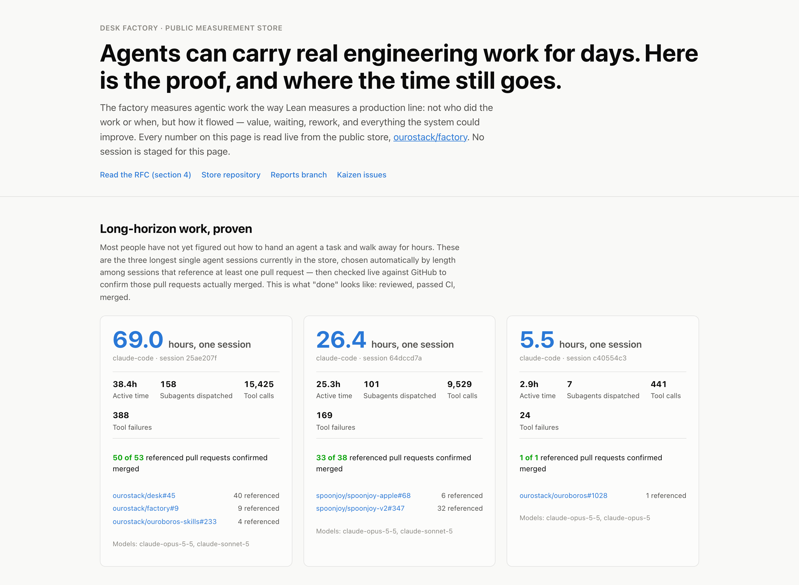

<!-- canonical-agentic-engineering-v2-rfc -->
# Agentic Engineering V2

Agentic Engineering V2 is a way of working in which humans hand agents whole engineering outcomes and agents carry them to an accepted result: planned together, executed autonomously, verified at the level of the claim, remembered across sessions, and measured so the work itself can be designed. This document is the reason the pieces exist and the contract they keep. It is written for the people who adopt V2 and, just as much, for the agents who do the work.

**How to read it:** with your agent. Start a session and ask it to walk you through this RFC and how it applies to what you're doing. The agents are the ones doing the work, and the agent living inside a system often sees what is broken better than we do ([The work spoke back](https://ouroboros.bot/blog/designing-with-your-agent/)), so its reading matters as much as yours. Agents load short foundations at the start of every session, one per layer; this document is the longer “why” behind them, read when someone wants the conversation, not on every boot.

**Agent, if you are reading this with someone:** relate each section to the work in front of you rather than explaining it in general. Say plainly where the way you two work matches a pattern in section 2, and where V2 itself looks wrong or confusing; that feedback is how V2 improves.

**Contract and status.** Sections 1 to 8 describe how V2 works when it is complete. Section 9 says what runs today; nothing in sections 1 to 8 should be described as working if section 9 lists it as being built. V2 lives at https://github.com/ourostack/desk, and its channel is that repository's `main` branch.

**Where things stand today, before you read the design.** As of 28 September 2026, V2 is opt-in alpha and an outside engineer can evaluate it end to end. Install, the startup foundations, channel-based updates, the public factory store and its [public site](https://ourostack.github.io/factory/) all run today. The kaizen loop, andon alarms and cross-job rollups are merged but not yet proven live end to end, and a self-review of the factory's own data caught and fixed two data-quality problems in it (details in section 9). A handful of gaps are still open, including draining recorded friction into kaizen cards and a separate factory store for work done under a company overlay. Section 9 is the complete, current account; treat nothing elsewhere in this document as already working where section 9 says otherwise.

**See it.** The public factory site is built live from the store: https://ourostack.github.io/factory/.

## 1. Why V2 exists

An agent can produce plausible local progress while still failing the actual job. It starts from the wrong source, splits one outcome across competing records, stops at a command that printed success, delegates without a bounded return, or treats a passing proxy as proof that an installed or rendered result works. Humans compensate by supervising: narrating steps, re-briefing every session, carrying context between tools, reading every line of every diff. The agent becomes a typewriter that needs supervising, and the human becomes the bottleneck twice over.

We think about the path out in three acts:

1. **Capability:** can an agent do real work on a computer? This is now solved enough.
2. **Orientation:** can an agent stay coherent across time, people and sessions: who it works for, what it's working on, what it promised, what it's allowed to do? Orientation is not a memory feature; it is a stance the substrate takes. This is the lens of Agent Experience: designing the system from the perspective of the agent that has to inhabit it. When staying oriented is expensive for the agent, the human becomes its recovery loop; when it is cheap, the collaboration keeps momentum ([What is Agent Experience?](https://ouroboros.bot/blog/what-is-agent-experience/)).
3. **Designed, measurable agentic labor:** once an agent stays oriented, the work itself becomes designable, the way industrial engineering designs systems around the worker instead of making the worker absorb the friction. We can see where effort is wasted, where attention should flow and what the atomic units of agent labor are, and we can measure whether a change helped. This is the factory in “software factory”, taken seriously.

That progression rests on a two-step claim. First, given durable context and a real engineering lifecycle, an agent can carry a long-horizon engineering task to a high-quality, merged result. Most people have not yet found a way to delegate work that runs for hours or days, so this has to be shown rather than asserted, and the [public factory site](https://ourostack.github.io/factory/) shows it with real sessions: as of this writing, the longest ran 69 hours in one session, with 50 of the 53 pull requests it referenced merged. Second, once that holds, the next problem is industrial-engineering-style work design: understanding what an agent actually does across a stretch that long, and whether the system around it can be improved. That is what the factory measures (section 4).

V1 of this system was built for weaker models and accumulated workflow machinery to compensate. V2 re-bases on current models: it keeps what nobody else provides (durable work state, authority and attribution), takes the engineering method from a maintained open-source provider, [Superpowers](https://github.com/obra/superpowers), instead of owning one, and adds a permanent way to answer the question every adopter eventually gets asked: *how much is this actually helping?*

V2 is an opt-in, measurable and replaceable experiment on the agent hosts people already use, not a claim that everyone should adopt one team's way of working. V2 applies keep-it-simple, build-only-what-is-needed and don't-repeat-yourself to itself: no mechanism without a real user, each rule stated in one place, and anything a shared runtime or a better provider replaces gets deleted. Its components earn their place by evidence.

## 2. Working together: the human and the agent

**Delegate outcomes, not steps.** The human supplies the intent, the material constraints, the authority and the desired endpoint. The agent owns everything else: sequencing, tool choice, decomposition, implementation, verification, recovery and cleanup, inside that authority. Beyond that, the human brings judgment: noticing that the question is misframed, deciding what matters, making the calls only a person can make. We don't do for the agent what it can do for itself, and the agent never hands the human a step it could do itself. A genuine human gate is one only a person can pass, such as a sign-in on their own device or a decision that is theirs to make.

**The planning is collaborative; the doing is delegated** ([Stop Being the Glue](https://ouroboros.bot/blog/stop-being-the-glue/)). New work starts with a real conversation in which the agent states its assumptions instead of acting on them, and helps the human put words to what they want: the outcome, why it matters, and what done looks like. The agent pulls every question that will need human judgment forward into this conversation, and the conversation ends with an explicit go. It is proportionate to the work: a clear, bounded request needs one confirming sentence, not a meeting, and bounded help stays bounded. A one-shot prompt that jumps straight into substantial work is a warning sign.

**After go, the agent owns the sequence to done.** It does not hand control back while tractable work remains, and it does not ask the human to steer work already delegated. It returns only for a genuine judgment call, missing authority, or because the human asked to talk. An agent that needs constant correction is an agent missing context; the correction is a bug report about the substrate, and the fix is to record that context durably so the next session doesn't need it.

**Agents coach the collaboration.** Most people don't know where to start or what they are doing wrong, and agents naturally go with the flow. So agents are expected to recognize the common failure patterns and say, once and plainly, “let's step back and reset how we're working”, with a concrete proposal:

- steps handed over one at a time instead of an outcome;
- micromanagement, or hovering over work in progress;
- a one-shot request with no alignment conversation;
- the human acting as glue: relaying output between tools or agents, or asking how and then doing it themselves;
- the work pulled back mid-flight: the human takes over a step the agent was handling, or the agent hands control back while tractable work remains;
- the same correction arriving again and again, or the human restating identity, restitching context and rebuilding the work after every interruption, which is an Agent Experience problem, not a memory problem;
- an ask too broad to assess, which the agent shapes into a clear outcome through conversation rather than shrinking. Ambitious delegation is welcome; over-reaching is how both sides find where the limits are.

Coaching happens once, stays short and actionable, and never becomes a recurring gate. Communication and trust are the two halves of delegation: trust without communication is “go figure it out”, and communication without trust is a micromanaged checklist. Before sending a request, read it from the agent's seat.

**Confidence without reading code.** Humans read every line of a change today because nothing else gives them confidence. V2 aims for evidence good enough that a human ideally never needs to: verification at the altitude of the claim, visual proof, receipts, and a measured account of how the work went.

## 3. Layers and ownership

Each layer has one job. Layers depend downward and never redefine one another.

| Layer | Owns |
| --- | --- |
| Host runtime | Launching agents, sessions, tools, and acquiring the selected plugins from their channels |
| Desk (and Crew, which turns one Git repository into a shared workspace for a team) | Durable work identity, continuity across sessions and machines, authority and attribution, the working relationship, browser access, the factory's evidence |
| Superpowers | The engineering method: brainstorming, planning, test-first implementation, verification and code review |
| Plain Language | How agents write for people |
| Consumer overlays | Identity, organization policy and environment-specific tools, added on top without copying anything below |
| Repository policy | Contribution authority, build and test gates, delivery and cleanup for the product being changed |

Desk does not become a second engineering method; Superpowers does not become a second task store; an overlay does not copy the foundation beneath it. Access to a repository does not create authority to change it.

**Startup is layered the same way.** Every layer that has something always-on ships its own short foundation and injects it once at session start, in stack order: `using-superpowers`, then the Plain Language contract, then `using-desk`, then each overlay's foundation. Section 9 says which hosts do this today. The Desk foundation gives the agent this document's installed path, so the agent can open it from any repository. The agent body on top carries identity and context only. An invariant lives in exactly one layer; a layer states only what it adds. Startup stays light, because a session usually starts to do work, not to reconsider its philosophy: the foundations say how humans and agents work together, and point here for why. When an agent finds instructions that are confusing, redundant or in conflict, it says so instead of being silently confused, and records the friction so it gets fixed.

**Durable context lives in the desk.** Instructions, preferences, task state and memory live in each person's desk, a Git repository, so they follow the person across machines and hosts. A desk holds tracks (areas of work, each with a `track.md`) and tasks (each with a `task.md` card that records the outcome, the go, the endpoint and progress), plus the friction and lessons that become fixes. A host's own configuration folder is only a thin pointer to the desk. Each repository holds one kind of thing: plugin repositories hold code, desks hold durable state, and factory stores hold measurement data. Work never carries AI attribution: no co-author trailers, no “generated with” lines.

**Every agent gets a browser.** Browser access is base level, because almost all real work touches the web. Desk selects a browser context from the contexts the workspace declares, matches on declared claims, and fails closed when none fits. Overlays add environment-specific browser providers, and no operator-specific paths live in plugin source.

## 4. The factory: measuring and designing the work

A factory is only a factory if it measures and designs the work. Sharing a place to work is orientation; designing it is the third act.

This section is the contract for how V2 measures work and the public method it grades by. The pipeline that runs it is being built; section 9 says how far.

**The unit of flow is the whole accepted job:** one outcome from intent to accepted result, including every session, machine, subagent, review round and retry it took. Output that is never accepted is inventory, scrap or rework, not progress. A job is one outcome; the desk records it as one durable task (section 5).

**Every stretch of work is value-adding, necessary support, or waste.** Value-adding work moves the accepted outcome forward in a way the requester would recognize. Necessary support is required by authority, safety, verification or policy, and adds no value the requester sees but cannot be skipped. Waste is neither. Where the evidence cannot tell, the stretch is unavailable. The waste types are the eight classic Lean wastes, translated for agent work: rework, overproduction, waiting, unused capability, handoffs, work in progress, context switching and overprocessing. The evaluator records unevenness in the flow and overburden where they explain waste. (Lean calls these three muda, mura and muri; V2's reports use the plain words.) Waste is never an action count or a stopwatch: optimizing those proxies rewards skipped proof and hidden rework. Necessary exploration and verification are not waste.

**Quality, flow and cost stay separate,** with quality floors checked first and no composite score. Flow is measured with established work-measurement statistics: lead time (start to acceptance), active time (time actually worked), waits (time blocked on someone or something else), work in progress (how many jobs are open at once), rework (work redone after it was thought finished), first-pass yield (the share accepted with no rework) and flow efficiency (active time as a share of lead time).

**Measure the system, never the people.** The subject is one accountable agent doing one job, including the work it delegated. Human replies and approvals are inputs and waits, not something to rank. There are no leaderboards, no cohorts and no study bureaucracy.

**Evidence is source-native.** Facts come from what the job already produces: session event logs, Git history, pull requests and CI, never from asking the working agent to keep a second ledger. The agent doing the work never grades itself; an independent evaluator classifies the work from the evidence and cites it. Anything that could not be observed is reported as unavailable, never as zero.

**Every finished job answers four questions:** what happened, what mattered, what was waste, and what we could not see.

**How the data flows.** When a session ends, its host hook derives facts for the work it touched: timings, tool use, waits, failures, retries, usage, model versions, plugin versions, and references to commits and reviews. The facts never include transcript text, prompts or file contents. Facts from every machine arrive as pull requests to the factory store for their trust boundary: personal use goes to the public store, [`ourostack/factory`](https://github.com/ourostack/factory), and an organization's work goes to its own store. There, CI enforces the privacy schema, normalizes the facts, rebuilds each job's timeline with the formulas above, regenerates its report, and merges. Contribution is opt-in and asked once at setup. Published facts carry no identity and no time of day: they hold durations and offsets instead of clock times, random session IDs, and, for a public desk, job IDs replaced by a keyed hash (HMAC) under a secret that stays on the machine ([publishing transform](../mcp/src/factory/publish.js)). A public store names only plugins installed from a public repository, such as the `ourostack` marketplace; every other plugin, including one whose source is unknown, appears only in a count of private plugins. An organization's own store keeps every plugin's name and version. Sessions that touch no task count as unattributed, not as missing work. The public store's data is visualized at https://ourostack.github.io/factory/, rebuilt after every store build.

**The rubric is public.** The grading method is this section and the evaluator's rubric ([factory-evaluator](../skills/factory-evaluator/SKILL.md)), both public and open to review, and every label names the rubric version that produced it. We hold our agent system to the kind of review we would give a colleague's work, and “we could not tell” is an acceptable answer.

**The loop closes.** Each job's waste feeds lesson capture, and friction about the shared system (Desk, its skills and tools, the factory) becomes a kaizen card: an issue in the desk's factory store that names the measure it should move, the direction, the countermeasure's pull request and, once it ships, the first version that carries it. (Kaizen is Lean's word for a small, continuous improvement.) A card in a public store carries structured fields only, never the desk's free text, and the kaizen worker — the role that turns a confirmed finding into a shipped fix, assigned to an agent rather than a person — files it only after the operator signs off. Every fact carries the versions that produced it, so on every build the store compares the card's measure between the jobs before and after that version, with the change in median and its 95% bootstrap interval. Jobs that share a session count as one independent group, and each side needs at least 6 groups: that is the fewest groups a method needs to compute a 95% confidence range for a median without assuming what shape the data follows; the minimum is computed from the confidence level, not a hand-picked number. The card is marked confirmed or not confirmed only when the whole interval lies on one side of zero; otherwise it shows “not enough independent jobs yet” or “no clear change so far” and keeps gathering data. The kaizen worker ships each card's countermeasure through the normal pull request flow, closes confirmed cards, and reverts or re-plans not-confirmed ones ([local capture](factory-local-capture.md), “The kaizen check”).

**Andon stops the line.** On every build the store also compares, for each plugin its maintainers list in the store's `factory.json`, the latest version with enough independent jobs against the one before it on the quality measures (tool failures, retries, rework and defect time), with the same 6-group minimum. When a version makes one clearly worse, the build opens an andon issue that names every plugin that changed in the same version set, and closes it itself once a later version recovers. A reviewer who judges an alarm false labels it `andon-dismissed`; the build then never reopens or closes it, but still posts new numbers. Each session start lists a contributing store's open andon issues in one line, and the kaizen worker handles them before any other card. Quality comes first: no flow gain can offset a quality regression.

**Waste judgment is every agent's job.** Before and during work, the agent asks whether each step adds justifiable, necessary, non-duplicative value; folds ad-hoc steps into the plan; parallelizes independent work and batches or resequences to avoid waiting; and redesigns the work when the same failure comes back instead of patching it again. The human never needs to know the vocabulary. “No waste” never means dropping proof.

## 5. Work, source and continuity

**One durable task per outcome.** A task is how the desk records one job, the factory's unit of flow. It carries the work through changed requirements, corrections, review findings, verification and cleanup. A material requirement that arrives mid-work updates the same task and invalidates only the evidence it affects; it does not become a side quest or a silent restart. A replacement session reconciles the same task, source, authority and uncertain side effects before it writes.

**Channels, never commits.** A channel is the branch consumers track; V2's channel is `main` of its repository. Everything tracks a channel: plugin dependencies, installs, setup links, docs, tests, fixtures, evaluations, review packets, handoffs and a task's recorded source. Dependency constraints are version ranges, never exact versions. A pinned commit silently freezes everyone downstream and keeps fixes from reaching them. There is no frozen candidate: reviewers and outside evaluators work on the channel as it is when they run, and record the commit they saw as evidence. A commit hash appears only as that kind of evidence. A note or handoff that says to freeze or pin something is wrong; correct it. Desks and shared workspace state live on their repository's default branch.

Upstream providers such as Superpowers are vendored from their own default branch and refreshed as it moves; the record of which upstream commit a copy came from is evidence, not a pin.

**Every task owns its resources** from creation: branches, worktrees, processes, browser sessions, artifacts. Completion means the outcome is delivered and every resource is removed, handed to a named owner, or deliberately kept with a reason.

## 6. Verification, visual proof and review

**Verify at the altitude of the claim.** A source test cannot prove an installed workflow; a terminal success line cannot prove a rendered result; an opened pull request cannot prove merged state. When a milestone claims an installed, rendered, merged, deployed or resumed result, the evidence shows that real state.

**Visual proof at every stage where it helps**, not only at the end: pull requests opened and merged, before and after states, rollout state, rendered artifacts, working logs. It supplements tests, logs and system-of-record readback; it never replaces them. It never exposes secrets, and nonvisual work gets no artificial screenshots.

**Review** goes through Superpowers' code review (`superpowers:requesting-code-review`). It reviews the current candidate and its evidence, records how each finding was handled, keeps one owner for corrections, and re-reviews only what a correction touched.

**Delivery policy is known up front** from the repository and the work, not chosen after implementation. When the recorded gates pass, the agent delivers and cleans up.

## 7. Getting V2 and staying current

**On Claude Code,** give your agent the link https://github.com/ourostack/desk/blob/main/SETUP.md and say “set this up.” It installs Desk, Superpowers and Plain Language, sets the host defaults, turns the host's configuration folder into a thin pointer, and finds your existing desk or creates a fresh one.

**On a managed launcher** that installs plugins from repository branches (for example the GitHub Copilot CLI through a company launcher), install the top-most plugin you use; its dependencies bring the rest of the stack from their channels. Some launchers refresh only the plugin you name, not its dependencies; if yours does, install the Desk plugins explicitly with the same refresh policy so their updates arrive right away.

**Updates reach everyone.** Claude Code updates a plugin when its version string changes; a launcher that installs from branches updates when the branch's contents change. V2 serves both: every plugin change ships on its channel as a new version, and CI enforces it. Desk takes its new version on `main` after the merge, from the changelog fragment the pull request adds, so parallel pull requests do not conflict.

**Your first job.** After setup, start a session and describe the outcome you want and why, not the steps. Your agent talks it through with you, records it as a task in your desk, and asks for go. After go, leave it to work: it comes back for a real decision, for authority it lacks, or with the result and its evidence. If you catch yourself relaying output, re-explaining context or narrating steps, expect your agent to suggest a reset, and take it.

**V2 replaces V1; it never runs alongside it.** Until the maintainer makes the promotion call, V2 is opt-in: you get it by installing from this repository. Promotion moves V1 users over; there is no parallel installation and no separate rollback package, because Git already holds the history. Existing alpha users who installed from the earlier repository move to this one automatically. V1's plugins in `ourostack/ouroboros-skills` keep working until promotion and retire with it.

## 8. Limits

V2 grants no repository, publication, destructive or rollout authority beyond what the human gave. Hosts differ in background, visual, review and recovery capabilities, and V2 does not promise every host supports every one. Codex can still run Desk, but it is not a supported target. Structural tests are not a substitute for installed behavior or editorial judgment. One successful job is not proof of a productivity improvement; the factory exists so that claims like that can be made honestly, or honestly withheld.

Public, generic policy lives here and in the layer foundations. Environment-specific rules belong in consumer overlays, product behavior in the product's repository, and each operator's preferences in their own desk.

## 9. Status

**As of 28 September 2026: opt-in alpha, ready for evaluation.** An engineer outside the team can now evaluate V2 with the [evaluation packet](evaluation-packet.md) ([#28](https://github.com/ourostack/desk/pull/28)). This section says what works today, what is built but not yet proven live end to end, and what is still open.

**Works today.**

- **Install from the channel.** Desk, Crew, Superpowers and Plain Language live in https://github.com/ourostack/desk, and V2 installs from its `main` branch on Claude Code ([setup](../../../SETUP.md)) and through a managed launcher with a company overlay ([#1](https://github.com/ourostack/desk/pull/1)). Alpha users who installed from the earlier repository move here automatically ([#3](https://github.com/ourostack/desk/pull/3)). Every plugin change bumps its version, and CI enforces it ([release check](../../../scripts/check-release-integrity.cjs)).
- **Startup foundations.** On both kinds of host, each layer's foundation loads exactly once at startup (Superpowers, Plain Language, Desk and the overlay's own), and the agent body carries identity only ([#4](https://github.com/ourostack/desk/pull/4), [#5](https://github.com/ourostack/desk/pull/5), [#7](https://github.com/ourostack/desk/pull/7)).
- **The RFC pointer.** The Desk foundation gives the agent this document's installed path, so an agent can open it from any repository ([#5](https://github.com/ourostack/desk/pull/5)). The repository root keeps a short [pointer](../../../AGENTIC-ENGINEERING-V2.md) to it.
- **Channels, never commits.** Plugin dependencies track `main`, never an exact commit, and CI enforces it ([#1](https://github.com/ourostack/desk/pull/1), [dependency check](../../../scripts/check-dependency-channels.cjs)). The docs and skills say there is no frozen candidate ([#8](https://github.com/ourostack/desk/pull/8)).
- **Always-on Desk.** The Desk server answers the host's handshake before any other work and never exits before it ([#14](https://github.com/ourostack/desk/pull/14), [#19](https://github.com/ourostack/desk/pull/19)). Hundreds of live launches have shown no handshake failure. The part of the live check that also requires a successful `desk_status` has not passed yet.
- **The public factory store.** [`ourostack/factory`](https://github.com/ourostack/factory) is live. Using the store pipeline ([#27](https://github.com/ourostack/desk/pull/27)), its intake validated and merged a synthetic facts file and built its report ([factory#8](https://github.com/ourostack/factory/pull/8)), and rejected a file that carried a date ([factory#3](https://github.com/ourostack/factory/pull/3)).
- **The public factory site.** A GitHub Pages site, https://ourostack.github.io/factory/, reads the public store live and renders it as the proof of long-horizon work, the work-design charts and the plain-language account section 4 promises; the store's build workflow rebuilds and redeploys it after every build, or on demand ([factory#92](https://github.com/ourostack/factory/pull/92)).
- **Delivery from an installed Desk, end to end.** On Desk 3.2.0-alpha.107, a fresh Claude Code session start delivered this machine's outbox as one intake pull request ([factory#55](https://github.com/ourostack/factory/pull/55)). The store validated it, merged it and rebuilt its reports, and every job's report has its four sections: what happened, what mattered, what was waste and what we could not see. The next session start delivered the first session's own facts as a new file — the intake pull requests are the evidence for the delivery itself ([factory#56](https://github.com/ourostack/factory/pull/56), [factory#58](https://github.com/ourostack/factory/pull/58)), and the Desk-side changes that produced them are the evidence for the mechanism ([#36](https://github.com/ourostack/desk/pull/36), [#44](https://github.com/ourostack/desk/pull/44)).
- **Private plugin names stay private.** A public store receives a plugin's name only when the plugin was installed from a public repository; the rest are counted as `refs.private.plugins` ([#63](https://github.com/ourostack/desk/pull/63)). The store refuses a new or changed facts file that lacks that count or names a plugin outside its public list, so an older Desk cannot put private names back ([factory#48](https://github.com/ourostack/factory/pull/48), [factory#57](https://github.com/ourostack/factory/pull/57)). The first delivery from the new Desk re-published every earlier file that way, and a scan of the store's current tree finds no private plugin name. Earlier commits in the store's history still hold the names; the history is not rewritten.
- **Session-end capture.** On Claude Code and Copilot CLI, the end of a session records its facts locally, outside any desk ([#26](https://github.com/ourostack/desk/pull/26), [local capture](factory-local-capture.md)). Contribution is opt-in ([#22](https://github.com/ourostack/desk/pull/22)), and the transform that produces published facts removes identity and time of day ([#18](https://github.com/ourostack/desk/pull/18)).
- **Job attribution, fixed going forward.** We reviewed the store's own job count the way we'd review a colleague's work, and found most of it was noise: 60 of the store's 73 job attributions came from one bulk tidy of task cards and its later revert, both housekeeping edits with no engineering behind them. Fixed in [#75](https://github.com/ourostack/desk/pull/75): a commit whose only change to a task's folder is a housekeeping edit to its `task.md` card — a rename, a move, or a change to only its `title`, `track` or `updated` field — no longer binds a job; a commit that touches the card's `status` or body still does. The housekeeping judge is now wider still: a tidy that only reformats a card's frontmatter byte-for-byte — a date gaining a redundant timestamp, a long field folded onto its own line — counts as housekeeping too, and the tidy tools themselves now patch only the field they mean to change instead of rewriting the whole card, which is what made those byte-level reformats happen in the first place ([#85](https://github.com/ourostack/desk/pull/85)). Separately, a long-running session could keep binding jobs under an older release's since-fixed logic even after it reported a newer plugin version; a deriver now holds instead of republishing under superseded logic once the Desk it is actually running predates the version its own session already declared ([#87](https://github.com/ourostack/desk/pull/87)). Correcting the store's existing attributions is in progress, not finished: two later store pull requests have since removed 72 polluted job entries across four sessions ([factory#87](https://github.com/ourostack/factory/pull/87), [factory#91](https://github.com/ourostack/factory/pull/91)), but the store's history is not rewritten.
- **Job identity survives a rename or move, fixed going forward.** A job's identity was derived from a task's current track and task path, so renaming or moving either started a new, disconnected job instead of continuing the old one. Fixed in [#81](https://github.com/ourostack/desk/pull/81): a job's identity is now the task's birth path — the track/slug its card, `task.md`, was first added at — found by following the card's own Git rename history, so a track rename, a task move or an archive move keeps the same job instead of splitting it. The fix stops new splits; a job that already split under the old scheme, before this fix, is not merged back together.
- **Waste labels.** The store gates waste labels as a second data path beside facts ([#34](https://github.com/ourostack/desk/pull/34)). An independent evaluator labeled a real job's waste ([#41](https://github.com/ourostack/desk/pull/41)), and those labels reached the store with its facts ([factory#55](https://github.com/ourostack/factory/pull/55)). That first labeling was a single manual run: nothing queued it automatically, so every other finished job went unlabeled. Fixed in [#78](https://github.com/ourostack/desk/pull/78): a task now queues its own evaluation request the moment it reaches a terminal status, `done` or `cancelled` alike, since a cancelled job is still a finished job whose waste is worth seeing.
- **No manual ledger.** The factory replaced the manual work-measurement ledger, which is retired: no tool, skill or instruction asks anyone to record work by hand. Records it left on a machine stay there, and `desk_doctor` counts them without reading or deleting them ([#52](https://github.com/ourostack/desk/pull/52)).
- **Browser access by default (section 3).** Desk declares a `desk-web` MCP server beside the Desk server on Claude Code and Copilot CLI, so a fresh install gets a headless, signed-out browser with no setup ([#48](https://github.com/ourostack/desk/pull/48) shipped it; [#137](https://github.com/ourostack/desk/pull/137) and [#141](https://github.com/ourostack/desk/pull/141) renamed the server to `desk-web`). A test fails when the two hosts' declarations differ or a server name is reserved ([#144](https://github.com/ourostack/desk/pull/144)). The first call on a fresh Copilot CLI install waits for the Playwright MCP install instead of failing; that was reproduced and checked live ([#148](https://github.com/ourostack/desk/pull/148)). `SETUP.md` and first-run onboarding now check a `browser_navigate`, and record a failure as not verified without blocking. The launcher keeps `@playwright/mcp` on its `@latest` channel and pins no version or commit; the company overlay's installer follows the same rule.
- **Superpowers follows upstream.** A weekly workflow refreshes the vendored Superpowers and releases it ([#32](https://github.com/ourostack/desk/pull/32)). Its first live run failed while filing its fallback issue, and the fix merged ([#40](https://github.com/ourostack/desk/pull/40)). The next run refreshed the copy and pushed it, but hit a repository setting that blocked GitHub Actions from opening pull requests here. The Actions permission that blocked PR creation was corrected, and the following run opened and merged its own pull request ([#46](https://github.com/ourostack/desk/pull/46)), closing the tracking issue ([#38](https://github.com/ourostack/desk/issues/38)).

**Built, not yet live end to end.**

- **Desk organization.** The naming and layout rules and the one-time tidy are merged ([#20](https://github.com/ourostack/desk/pull/20), [#21](https://github.com/ourostack/desk/pull/21), [#25](https://github.com/ourostack/desk/pull/25)). The tidy is not yet proven on real desks, and a fix for tidying single-owner hub desks has merged ([#37](https://github.com/ourostack/desk/pull/37)).
- **The kaizen loop and andon.** The store's build checking kaizen cards and raising andon issues is merged ([#53](https://github.com/ourostack/desk/pull/53), [factory#40](https://github.com/ourostack/factory/pull/40)). The first live card, [factory#39](https://github.com/ourostack/factory/issues/39), targets tool failures; its countermeasure ([#49](https://github.com/ourostack/desk/pull/49)) stops the checkout guard from failing closed on long shell loops and shipped in Desk 3.2.0-alpha.98. The store's first build after the merge checked the card and reported “not enough independent jobs yet” ([check](https://github.com/ourostack/factory/issues/39#issuecomment-5860353764)). That verdict cannot change once the whole fleet has moved past the version a fix shipped in: the “before” side of the comparison needs jobs older than that release, and it can never gain another one. All six kaizen cards filed to date ran into exactly that: [factory#39](https://github.com/ourostack/factory/issues/39), [factory#51](https://github.com/ourostack/factory/issues/51), [factory#52](https://github.com/ourostack/factory/issues/52), [factory#53](https://github.com/ourostack/factory/issues/53) and [factory#54](https://github.com/ourostack/factory/issues/54) each still read zero pre-fix job groups when closed, and [factory#50](https://github.com/ourostack/factory/issues/50) was filed with its countermeasure and version already recorded before it had a chosen signal or hypothesis, so the check could never score it either. All six are now closed on their merged, verified fixes instead of a statistical verdict, under a rule the curator (the kaizen-worker skill) now follows: close a card the store can structurally never confirm on the evidence for its fix, and never record a countermeasure or version on a card before it has a signal and hypothesis ([#83](https://github.com/ourostack/desk/pull/83)). Filing system friction as kaizen cards after the curator's signoff — `curator` is the agent skill that fills the kaizen-worker role — has merged ([#54](https://github.com/ourostack/desk/pull/54)), as has listing open andon issues at session start ([#55](https://github.com/ourostack/desk/pull/55)). A fixture store, with GitHub simulated, shows andon opening an alarm, leaving it alone while too few jobs arrive, and closing it when a later version recovers ([test](../../../tests/desk/mcp/__tests__/factory/andon_regression.test.js)); no live andon alarm has fired yet.
- **The evaluator and rollups.** The observer agent that evaluates work it did not do ([#28](https://github.com/ourostack/desk/pull/28)) and rollups of waste across jobs ([#39](https://github.com/ourostack/desk/pull/39)) are merged, and a job's report now shows its labels ([#67](https://github.com/ourostack/desk/pull/67)). The first labeled job is still open, so the rollups count no labeled job yet.

**Still open.**

- A kaizen verdict on live data: the first card needs at least 6 independent groups of finished jobs on each side of its countermeasure's release before the build can confirm it or not.
- Draining recorded friction into kaizen cards: [#54](https://github.com/ourostack/desk/pull/54) shipped the filing step and made `curator` the kaizen worker; the curator's first pass over the desks' friction has not run yet.
- A separate factory store for work done under a company overlay, and the admin session that manages it (section 4, “How the data flows”). Routing is built: a session that loads the overlay goes to the overlay's store and never to the public one ([#44](https://github.com/ourostack/desk/pull/44)). Until that store exists and the machine consents to it, such sessions are delivered nowhere.
- Signed-in browsing on a fresh personal install. The browser context broker runs once its dependency is installed (`desk:cdp-headed-browser` has the commands), but only a company overlay supplies the provider that launches the signed-in browser, so `acquire` fails closed without one.
- A fresh install on Claude Code, from `SETUP.md` through a first `browser_navigate`, recorded end to end on a clean profile. The browser's pieces are each proven (below), but that single run has not been recorded.

**Next.** An evaluation by an engineer outside the team, then the maintainer's decision on promotion.
